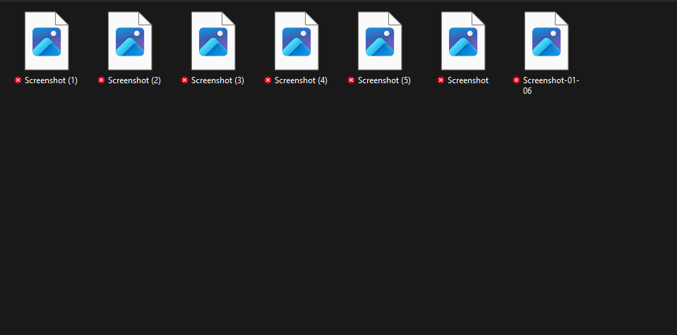

# Python File Organizer

## Overview
Python utility for organizing files by date and normalizing filenames, with safe collision handling and support for multiple file types.

The script scans a directory, groups files into date-based folders, cleans inconsistent filenames (such as timestamps or copy numbers), and safely renames files to prevent overwriting.

---

## Features
- Organizes files into folders based on file creation date (`YYYY-MM-DD`)
- Cleans filenames by removing timestamps, copy numbers, and extra digits
- Prevents overwriting by automatically appending `(1)`, `(2)`, etc.
- Works with multiple file types (PNG, expandable to others)
- Designed for Windows file systems

---

## Configuration

Before running the script, update the source directory to match your environment.

### Option 1: Pass the directory directly (recommended) 

```python
png_finder(source_dir=r"C:\Users\yourname\Pictures\Screenshots"):
```

### Option 2: Use the default parameter
If you prefer, you can edit the default value in the function definition:

```python
def png_finder(source_dir=r"C:\Users\yourname\Pictures\Screenshots", dest_root=None):
```

---

### Usage

Open a Python shell and run:

```python
from png_finder import png_finder
```

---

The script will create an output folder (by default named PNGS) and organize files into date-based subfolders.

Example Output Structure:

```PNGS/
├── 2025-11-26/
│   ├── Screenshot.png
│   ├── Screenshot (1).png
├── 2025-11-27/
│   ├── Screenshot.png
```

---

## Screenshots

### Before
Files with inconsistent names and copy numbers before running the script.


### After
Files organized into date-based folders with clean filenames.


